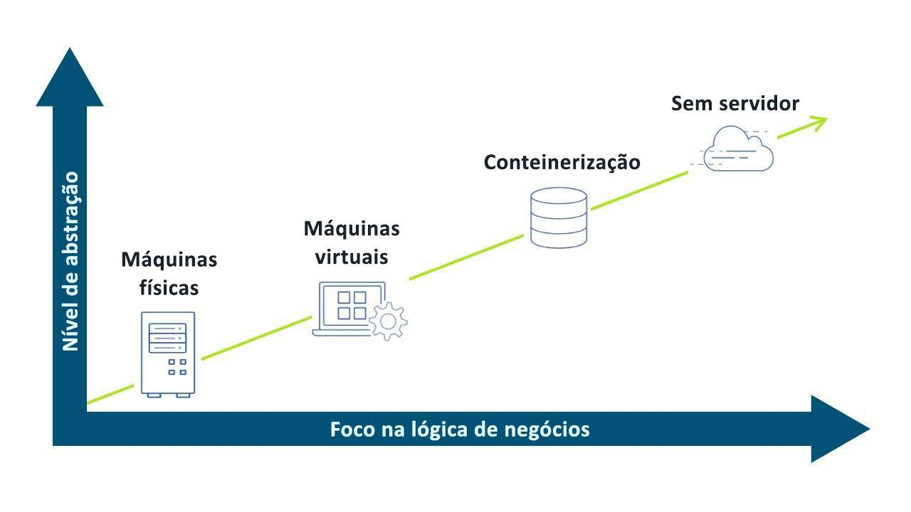
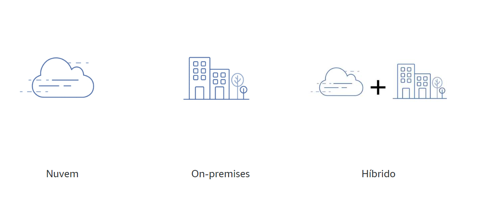
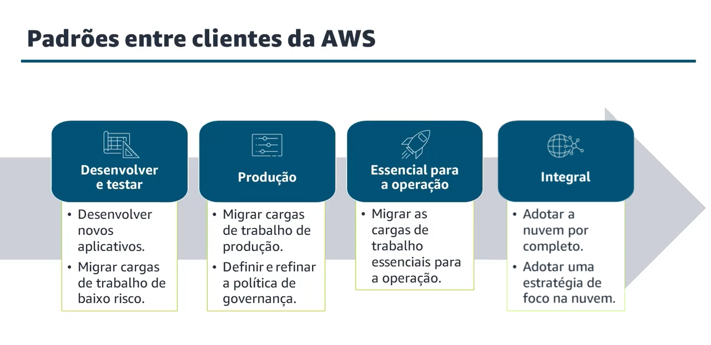
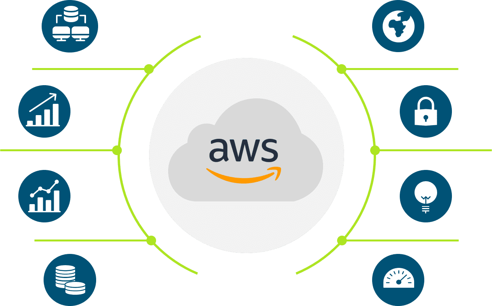

# Conceitos de Nuvem

## O que é computação em nuvem?

"A computação em nuvem é a entrega de recursos de TI sob demanda pela internet com pagamneto conforme o uso." 
Computação em nuvem é a entrega de recursos de TI sob demanda pela Internet com pagamento conforme o uso. Em vez de comprar e manter data centers e servidores físicos, você acessa os serviços de tecnologia conforme sua necessidade.  

## AWS Lambda

É um serviço computacional focado em eventos integrado nativamente a mais de 200 serviços da AWS. Basta fornecer o código, definir o que vai acionar a função AWS Lambda e a AWS a invoca, isso chama invocar uma função Lambda e você só pagará pelo tempo usado.
## Tendências na evolução da computação

O visual a seguir descreve as tendências na evolução da computação. Quanto mais alto você for nos níveis de abstração, mais o provedor de nuvem poderá agregar valor e descarregar atividades não estratégicas do consumidor. Para saber mais, escolha cada marcador numerado.  

- ` Máquinas Físicas: Investimento pesado e Duração on-premises por anos;`
- ` Máquinas Virtuais: Recursos Elásticos e Provisionamento mais rápido;`
- ` Conteinerização: Independência de plataforma e Implementações mais simples e rápidas;`
- ` Sem Servidor: Orientado a eventos e Pagamento por uso.`

## Modelos de implantação de computação em nuvem

Quando alguém fala na “nuvem” no contexto de uma nuvem compartilhada ou pública, está se referindo a uma infraestrutura sob demanda fornecida por uma empresa como a AWS. As organizações que usam a nuvem pública podem aproveitar outras soluções fornecidas por um provedor de serviços de nuvem, como uma ou qualquer combinação das seguintes opções: 

Software como serviço (SaaS)  
Plataforma como serviço (PaaS)  
Infraestrutura como serviço (IaaS)  

## Há vários tipos de modelos de implementação

Um deles é a nuvem, que pode ser on-premises ou híbrida. Tudo ou a maioria dos seus ativos pode estar hospedados em um provedor, como a AWS. As organizações colocam os recursos on-premises ou em colocation, agora chamamos de on-promises e antes de nuvem privado. E híbrido, ou seja, quando está nos dois tipos, unindo esses dois modelos de implantação.

## Padrões entre clientes da AWS

Em relação ao caminho para a adoção da nuvem, cada cliente traça um roteiro diferente. Muitos fatores internos e externos influenciam o processo de tomada de decisões e determinam onde eles começam na jornada. As adoções nem sempre são lineares, e os clientes podem estar em qualquer uma das quatro fases diferentes (às vezes ao mesmo tempo).  

Obs: “Integral” não significa estar 100% na nuvem. Poucos clientes estão 100% na nuvem, principalmente aqueles que começaram com sistemas on-premises.

<a href="https://aws.amazon.com/pt/blogs/architecture/compute-abstractions-on-aws-a-visual-story/" target="_self"  rel="prev">Mais informações em AWS BLOG</a>

## Por que os Clientes Escolhem a AWS?
"Obsessão pelo cliente significa colocá-lo no centro e proporcionar a ele uma experiência do usuário atraente. Quando entendemos o problema do cliente e proporcionamos uma ótima experiência, isso gera valor para empresas."  

A AWS oferece muitos benefícios aos clientes por meio de diversos serviços, metodologia de redução de custo e foco no crescimento e inovação do cliente. Todos esses benefícios são disponibilizados aos clientes em escala global, de modo que as empresas com presença internacional possam se beneficiar dos serviços da AWS. 

<!---->

