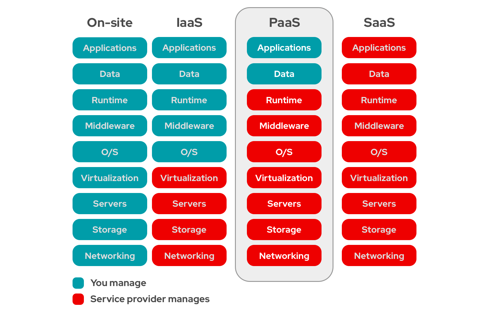

<a href="../README.md" target="_self"  rel="prev"> <<< Página anterior </a> <a href="#" target="_self"  rel="prev"> Página seguinte>>> </a>

# Tipos de cloud 

Existem diferentes tipos de serviços englobados em cloud. Eles categorizam para ficar mais fácil de se entender.

## IaaS

IAAS (Infrastructure as a Service): Com o IAAS, a AWS oferece a infraestrutura básica de TI na nuvem, incluindo servidores virtuais, armazenamento e redes. O usuário tem controle total sobre o sistema operacional, aplicativos e dados, mas é responsável por gerenciar a infraestrutura e manter a segurança e o desempenho.

## PaaS

PAAS (Platform as a Service): Com o PAAS, a AWS oferece uma plataforma completa de desenvolvimento e implantação de aplicativos na nuvem, incluindo sistemas operacionais, middleware, bancos de dados e ferramentas de desenvolvimento. O usuário tem controle sobre o aplicativo e os dados, mas não precisa se preocupar com a infraestrutura subjacente.

## SaaS

SAAS (Software as a Service): Com o SAAS, a AWS oferece aplicativos prontos para uso na nuvem, como email, CRM (Customer Relationship Management) e ferramentas de colaboração. O usuário tem acesso aos aplicativos por meio de uma interface web e não precisa se preocupar com a infraestrutura, o sistema operacional ou as atualizações de software.

 
_______________________________________________________________________________________________________________________________________________________________________
 

Eu troxe  um gráfico logo abaixo que vai te explicar. Basicamente, eu vou te dar alguns modelos sobre cada um deles.
Por exemplo, quando você tem um site, significa que está dentro da sua empresa, o que significa que você tem que fazer a parte de redes, de vermelho está o Cloud Provider, quer dizer, o provedor de cloud, no caso AWS.

Quando você contrata um IaaS você está pagando somente pela infraestrutura, fora isso, é você que gerencia. Eles gerenciam a infraestrutura.   
Se você paga por um PaaS, eles gerenciam a plataforma e você gerencia a aplicação que está no topo da plataforma.  
Por exemplo, se você contrata um SaaS, eles gerenciam a aplicação e você não fica fazendo quase nada.  

## Privado, Público e Híbrido Cloud

Os termos "privado", "público" e "híbrido" são frequentemente usados para descrever diferentes tipos de infraestruturas em nuvem.

Um ambiente de nuvem privada é uma infraestrutura que é dedicada exclusivamente a uma única organização. Isso significa que a infraestrutura em nuvem é gerenciada e mantida pela organização, e não compartilhada com outras entidades. Esse tipo de ambiente é adequado para empresas que precisam de um alto nível de controle e segurança sobre seus dados e aplicativos.

Por outro lado, um ambiente de nuvem pública é uma infraestrutura que é gerenciada por um provedor de serviços em nuvem, como a Amazon Web Services (AWS) ou a Microsoft Azure. Nesse modelo, várias organizações compartilham a mesma infraestrutura em nuvem. A nuvem pública é geralmente mais econômica e flexível do que a nuvem privada, pois as despesas com infraestrutura são compartilhadas por muitos usuários. A nuvem pública é adequada para empresas que desejam escalabilidade e acesso fácil e rápido aos recursos da nuvem.

Por fim, um ambiente de nuvem híbrida é uma combinação dos dois modelos anteriores, em que uma empresa usa tanto uma nuvem privada quanto uma nuvem pública. Por exemplo, uma empresa pode usar uma nuvem privada para armazenar dados sensíveis, enquanto usa uma nuvem pública para executar aplicativos e serviços que precisam de escalabilidade e disponibilidade. A nuvem híbrida é adequada para empresas que desejam combinar os benefícios da nuvem privada e pública em uma única solução.

## Serviços Dentro da AWS

Primeiro, o que é um serviço? É qualquer coisa que você possa iniciar, Configurar e finalizar, ou então parar o serviço ou finalizar, a AWS conta isso como sendo um serviço.

Então, por exemplo, se você precisa de uma máquina, de um servidor. Você precisa desse servidor para armazenar arquivos dentro dele. Consequentemente, você precisa de um servidor com uma parte de storage um pouco maior, porque você vai armazenar arquivos lá dentro, A AWS ao invés de chamar de servidores, ela chama de EC2, então esses dois é o nome do serviço que está disponível dentro da AWS para a criação de servidores virtuais.

Se por acaso você quiser comprar um domínio de internet, o www.algumacoisa.com. Para você comprar esse domínio Você precisa acessar um serviço da AWS que é chamado de Roteamento ou Rota53 e dentro desse serviço você pode fazer a compra da sua URL e a compra do seu domínio aí.

<a href="../README.md" target="_self"  rel="prev"> <<< Página anterior </a> <a href="#" target="_self"  rel="prev"> Página seguinte>>> </a>

