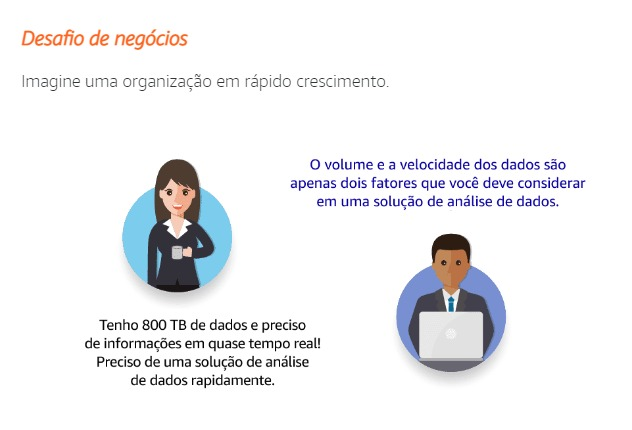

# Introdução a soluções de avaliação de dados

Hoje em dia, a maioria das pessoas já ouviu termos como: Análise de Dados e Big Data. Pessoal, há quanto tempo se fala sobre Big Data? Parece que é desde sempre, né? Você provavelmente assistiu, leu ou até mesmo participou de reuniões sobre isso. Provavelmente já te perguntaram se a sua empresa tem um problema de Big Data. Mas, isso seria realmente simplificar demais.

A verdadeira pergunta é: de que tipo de solução de análise de dados a sua empresa precisa? Em outras palavras, como armazenar, processar, analisar e apresentar dados? Como proceder desde a ingestão até a visualização? E outra coisa, como você sabe se a empresa está pronta pra esse tipo de solução? Se você já tem uma, como saber se é o momento certo de migrar pra nuvem? E gente, o que realmente está envolvido nesse processo de migração? A computação em nuvem tem tudo a ver com movimentação rápida, configurações mínimas e tudo isso com o máximo de segurança e com grande custo-benefício. Por isso, considerar a migração de sua solução de análise de dados para a nuvem pode ser algo interessante.

Discutiremos os principais componentes dessas soluções de análise de dados. Falaremos sobre os desafios que surgem à medida que você começa a planejar as soluções de Data Analytics e como a AWS pode te ajudar nesse processo com as tecnologias cada vez mais dinâmicas presentes na nuvem.

## Análise de dados e soluções de avaliação de dados

Avaliação é um exame detalhado de algo para entender sua natureza ou determinar suas características essenciais. Avaliação de dados é o processo de compilar, processar e analisar dados para que você possa usá-los para tomar decisões.

Análise é a avaliação sistemática de dados. Análise de dados é o processo analítico específico sendo aplicado.

A análise de dados é vital para empresas de pequeno e grande porte. Os processos analíticos de dados são combinados para criar soluções de avaliação de dados, que ajudam as empresas a decidir onde e quando lançar novos produtos, quando oferecer descontos e quando comercializar em novas áreas. Sem os dados fornecidos por análise de dados, muitos responsáveis por tomar decisões se baseariam em intuição e pura sorte. 

À medida que as empresas começam a implementar soluções de avaliação de dados, surgem desafios. Esses desafios são baseados nas características dos dados e das análises necessárias para o caso de uso dessas empresas. No passado, esses desafios foram definidos como desafios de “big data”. Entretanto, no ambiente atual baseado na nuvem, esses desafios podem se aplicar a conjuntos de dados pequenos ou lentos quase tão frequentemente quanto a conjuntos de dados muito grandes e rápidos.

Este curso mostrará como identificar a solução de avaliação de dados que melhor atenda aos seus requisitos e como planejar e executar uma estratégia para implementá-la.

Neste tópico discutiremos alguns desafios associados a enormes workloads. Também discutiremos de onde esses dados vêm e alguns dos desafios associados a soluções de análise de dados. Minha parte favorita dessa sessão é tirar o mito do Big Data. A falsa ideia que o Big Data abrange todos os casos de uso de análise de dados. Além disso, ajudar você a entender os desafios de trabalhar com dados em escalas massivas. Conforme nos tornamos uma sociedade digital, a quantidade de dados que criamos e coletamos, aumentou significativamente. Além disso, o ritmo de crescimento está acelerando. Criamos sistemas para lidar com a coleta de dados e esses sistemas armazenam todos esses dados de forma muito eficiente. Mas,vamos pensar assim: - o que acontece se você receber suas correspondências todos os dias durante meses e em vez de abrir, deixá-las ali apenas em cima da mesa da cozinha. As cartinhas se acumulam. Você não nunca abre, né? E se você fizer isso irá deixar de saber algumas coisas. Agora, pense em uma grande empresa. As empresas podem gastar milhões de dólares em armazenamento de dados físicos. E, exatamente como as correspondências sobre essa mesa, esses dados podem acabar nunca sendo analisados. 

Às vezes, é porque isso parece ser muito custoso pra ser analisado ou parece muito técnico realizar isso. Agora, vamos falar sobre de onde vêm esses dados? Como provavelmente deve saber, você pode obter dados de uma grande variedade de fontes. Os dados gerados por humanos são dados criados diretamente por humanos que digitam as informações em um sistema ou aplicativo. E a maior e mais conhecida: fonte de dados. Ele inclui e-mails, documentos, planilhas, imagens, dados armazenados em bancos de dados e muito mais. Os dados gerados por computador são criados por aplicativos sem instruções humanas direta. Geralmente, isso resulta de uma combinação de entradas geradas por humanos com informações adicionais coletadas por um sistema. Por exemplo: pós preencher um formulário on-line e colocar meu nome e a minha ocupação e o meu endereço. Com base nesses dados gerados por humanos, o aplicativo pode pesquisar minha profissão, descobrir a renda média da minha profissão com base na cidade em que eu moro. 

O aplicativo pode correlacionar essas informações com vagas de emprego e até mesmo enviar um e-mail para mim informando sobre essas vagas. Assim, a renda média e as vagas de emprego são dados gerados por computador. A outra forma de dados gerados por computador, que ainda tem menos a ver com humanos. Esses dados são gerados registrando as ações dos aplicativos e o comportamento de sistemas e dispositivos de rede dentro de uma rede. Esses dados geralmente estão nas formas de arquivos de log semi-estruturados, mas também podem estar armazenados no formato binário. Essas estruturas de dados às vezes são difíceis de analisar, mas fornecem grande valor para correspondência de padrões e é a realização de correlações entre eventos. Isso ajuda as empresas a tomarem decisões mais rapidamente, com melhores informações. Então, o problema não é encontrar os dados. 

O problema é não conseguir fazer nada com eles. Isso pode resultar na perda de oportunidades, no aumento de custos, na redução de produtividade e na diminuição da competitividade. Desenvolver uma estratégia sólida para analisar quantidades tão grandes de dados pode ajudar a reduzir custos e a obter eficiência operacional. As soluções de Data Analytics são mais amplas do que as soluções de Big Data são compostas de coleta, armazenamento, processamento e visualização de dados. Como o Big Data se encaixa nas soluções de análise de dados? As soluções de Big Data podem fazer parte das soluções de análise de dados. O termo Big Data tem sido usado para descrever os desafios de trabalhar com conjuntos de dados em grandes quantidades, a velocidades incríveis, produzido em sites rápidos. Mas nem todas as organizações possuem essas três coisas ao mesmo tempo. E nem todas as soluções de análise de dados são executadas em grande escala. Essa é a principal diferença entre as duas. 

Empresas que lutam por uma vantagem no mundo digital, reconhecem a necessidade de aprender sobre seus clientes e usar essas informações para atender melhor. Essas empresas precisam de uma solução para analisar seus dados. Grande ou pequena, o processo para implementar uma solução é o mesmo. E nós discutiremos isso nos próximos vídeos. As organizações usam soluções de análise de dados para extrair valor dos seus dados. O que uma solução de análise de dados faz? Ela ajuda você a gerenciar todo o ciclo de gerenciamento de dados, desde a coleta dos dados brutos até o armazenamento, o processamento e a análise, além de visualizá-los na forma de um relatório ou dashboard. No próximo tópico, discutiremos cinco indicadores essenciais que significam que a sua solução de análise de dados pode exigir grandes considerações.

"As organizações gastam milhões de dólares em armazenamento de dados. O problema não é encontrar os dados, mas 
deixar de fazer algocom eles."

### Benefícios de análise de dados em grande escala

- Personalização do cliente: Quais produtos devem ser mostrados ao cliente com base em seus hábitos de compra?
- Detecção de fraudes: Essa transação pendente é fraudulenta?
- Detecção de ameaças à segurança: Quais padrões de uso indicam possíveis riscos de segurança de agentes mal‑intencionados?
- Comportamneto do Usuário: Com base em feeds de redes sociais, qual o nível de influência que essa pessoa tem? Que tipos de produtos ou serviços essas pessoas teriam interesse em promover?
- Modelagens e previsões financeiras:Quais tendências podem ser detectadas nesses terabytes de dados financeiros? Como isso pode ser usado para prever futuras mudanças de mercado?
-Alerta em tempo real: Qual é o problema e quem precisa ser notificado?

Soluções eficazes de avaliação de dados exigem armazenamento e capacidade de avaliação de dados praticamente em tempo real, com baixa latência, gerando retornos de alto valor.

### Características do big data

 

Os dados são gerados de várias maneiras. A grande questão é onde colocar todos eles e como usá-los para extrair valor ou gerar vantagens competitivas. Os desafios identificados em muitas soluções de avaliação de dados podem ser resumidos por cinco desafios principais: volume, velocidade, variedade, veracidade e valor.

Nem todas as organizações enfrentam desafios em todas as áreas. Algumas organizações têm dificuldades com a ingestão de grandes volumes de dados rapidamente. Outras têm dificuldade com o processamento de grandes volumes de dados para produzir novas informações preditivas. E ainda há outras com usuários que precisam executar avaliaçãos de dados detalhadas dinamicamente em conjuntos enormes de dados. 

Gente, como você sabe se precisa de uma solução mais complexa de análise de dados ou até mesmo de uma básica? Vamos lá. Pergunte a si mesmo: - Você está tendo dificuldades pra suportar aumentos repentinos no volume de dados com as quais está lidando? Ou a velocidade com que esses dados novos chegam? E a variedade de fontes de dados? Isso é um problema? E a precisão? Me fala a verdade, você está extraindo o valor de seus dados?

Vamos abordar um “V” por vez. Começando pelo primeiro. Quando eu falo sobre volume, quero dizer a quantidade de dados que uma solução deve processar. A solução deve fazer isso com eficiência e ser capaz de distribuir a carga entre servidores suficientes para lidar com o próximo “V”: velocidade.

Velocidade é a rapidez com que os dados entram e transitam por sua solução. Muitas empresas agora usam grandes volumes de dados de streaming em tempo real. As soluções devem ser capazes de consumir e processar esses dados rapidamente.

Sim! O terceiro “V” é de variedade. A ingestão de dados de tipos e fontes diversas pode significar muitos desafios diferentes, como chega ali a hora de analisar esses dados. Empresas inteligentes criam soluções pra trabalhar com diversos tipos de dados: infraestruturados, semiestruturados e completamente não estruturados. Nós veremos os tipos de dados mais pra frente neste curso.

O quarto “V” é a veracidade, que se refere à confiabilidade dos seus dados. Você já ouviu aquele ditado? “Eu te dou a minha palavra.” Deve passar confiança, uma vez que a pessoa se comprometeu a passar a informação correta. Isso é a veracidade. Para ter dados confiáveis, você precisa saber a procedência deles.

Você pode nos dizer o que significa procedência?

Claro! Procedência significa que você conhece a cadeia de custódia, chain of custody, destes dados; que você pode dizer, com certeza, que os dados não foram adulterados. A coleta de dados não é fácil, garantindo a precisão e a consistência. Essa é a parte mais difícil, que é a veracidade.

E o quinto “V” é o valor, que é o nosso objetivo geral de todo esse esforço. Isso inclui a criação de relatórios e dashboards que informam decisões críticas ao negócio, deixando em destaque as áreas que precisam de melhoria pra facilitar a localização e a comunicação de detalhes críticos sobre as operações de negócio. E aqui estão os “cinco Vs” do Big Data. Agora que discutimos indicadores que mostram que você pode precisar de uma solução para analisar os seus dados, vamos falar sobre o que você precisa saber para se preparar para uma.

Primeiro: você precisa saber de onde os dados estão vindo. A maioria dos dados analíticos vêm de bancos de dados e de armazenamento de arquivos existentes, on-premesis. O streaming de dados está se tornando cada vez mais popular, assim como o conjunto de dados públicos para enriquecer as outras fontes de dados que é a sua solução acessará. Falaremos tudo isso nas lições 2 e 4.

Em segundo lugar, você precisa conhecer as opções para processar os seus dados. O termo processamento inclui: coletar, limpar, transformar e carregar dados em um armazenamento de dados analítico. E isso, é muito trabalho. Esse processo pode ser gerenciado manualmente ou com aplicações que irão ajudar na parte da automação. Vamos discutir isso nas lições 3 e 5.

Por fim, você precisa saber o que você precisa aprender com seus dados. A coleta e o processamento de todos esses dados devem resultar em insights práticos. Muitas vezes, esses insights são apresentados nas formas de relatórios e dashboards. Discutiremos tudo isso na lição 6.

Devido ao aumento de volume, velocidade, variedade, veracidade e valor dos dados, alguns desafios de gerenciamento de dados não podem ser resolvidos com soluções tradicionais de banco de dados e processamento. É aí que entram as soluções de avaliação de dados.

## Componentes de uma solução de avaliação de dados

Uma solução de avaliação de dados tem muitos componentes. A análise realizada em cada um desses componentes pode exigir diferentes serviços e abordagens. 

  

